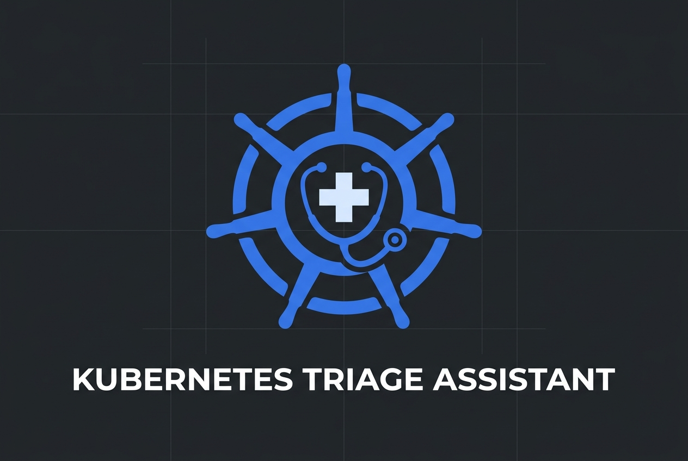

# Kubernetes Triage Assistant (`k8s-triage-agent`)



A production-ready, autonomous CLI and service daemon that inspects, analyzes, and troubleshoots Kubernetes cluster issues using the OpenAI SDK tool-calling paradigm.

## Features
- **Read-Only Inspection**: Safely queries the cluster without mutation permissions.
- **Automated Root Cause Analysis**: Identifies failing pods, correlates events, and analyzes logs.
- **Security & Guardrails**: Includes log truncation to protect LLM context windows and redacts sensitive information (secrets, tokens, passwords).
- **Interactive CLI**: Typer/Rich based CLI for beautiful formatting and easy interaction.

## Installation

```bash
uv venv
source .venv/bin/activate
pip install -e .
```

## Usage

Export your OpenAI API key:
```bash
export OPENAI_API_KEY="sk-..."
# Or use the K8S_TRIAGE_ prefix
export K8S_TRIAGE_OPENAI_API_KEY="sk-..."
```

Run an analysis:
```bash
k8s-triage analyze --namespace default --pod my-crashing-pod
```

Start interactive mode:
```bash
k8s-triage interactive
```

## Quickstart: Witness It in Action

The fastest way to see KTA troubleshoot a cluster issue locally is using **kind**, **Minikube**, or Docker Desktop Kubernetes with an intentionally failing pod.

### Step 1: Deploy a Crashing Pod to your Cluster
Spin up a test service that fails on startup and enters `CrashLoopBackOff`:

```bash
kubectl apply -f - <<EOF
apiVersion: v1
kind: Pod
metadata:
  name: crashing-payment-service
  namespace: default
  labels:
    app: payment-service
spec:
  containers:
  - name: app
    image: busybox:latest
    command: ["sh", "-c"]
    args:
    - echo "Starting payment service...";
      echo "Connecting to DB at postgres://db.internal:5432...";
      sleep 2;
      echo "FATAL: Connection refused. Missing DB credentials secret.";
      exit 1
  restartPolicy: Always
EOF
```

### Step 2: Set Environment & API Key
```bash
cd k8s-triage-assistant
source venv/bin/activate
export OPENAI_API_KEY="sk-..."
```

### Step 3: Run the Triage Agent!
Target the crashing pod directly:
```bash
k8s-triage analyze --namespace default --pod crashing-payment-service
```

Or let the agent autonomously discover failing pods across the namespace:
```bash
k8s-triage analyze --namespace default --prompt "Check for any failing services"
```

Or start an interactive shell:
```bash
k8s-triage interactive
```

### What You Will See:
1. **Live Spinners**: Real-time status indicators as the agent queries cluster state via tools (`list_pods_with_conditions`, `get_pod_logs`, `get_namespaced_events`).
2. **PII/Secret Sanitization**: Passwords, connection URIs, tokens, and keys in logs are automatically replaced with `[REDACTED]`.
3. **Rich RCA Report**: A structured Markdown panel with:
   - **Incident Summary**
   - **Culprit Pod/Node**
   - **Root Cause Analysis** (citing container termination reasons and error logs)
   - **Recommended Action**

## Testing & CI

Unit tests can be run locally with `pytest`:

```bash
pytest tests/
```

### Continuous Integration (CI)
A GitHub Actions workflow (`.github/workflows/ci.yaml`) runs on every pull request and push to `main` across Python 3.11 and 3.12:
- Code style and linting with **Ruff**
- Strict static type checking with **Mypy**
- Automated test execution with **Pytest**

